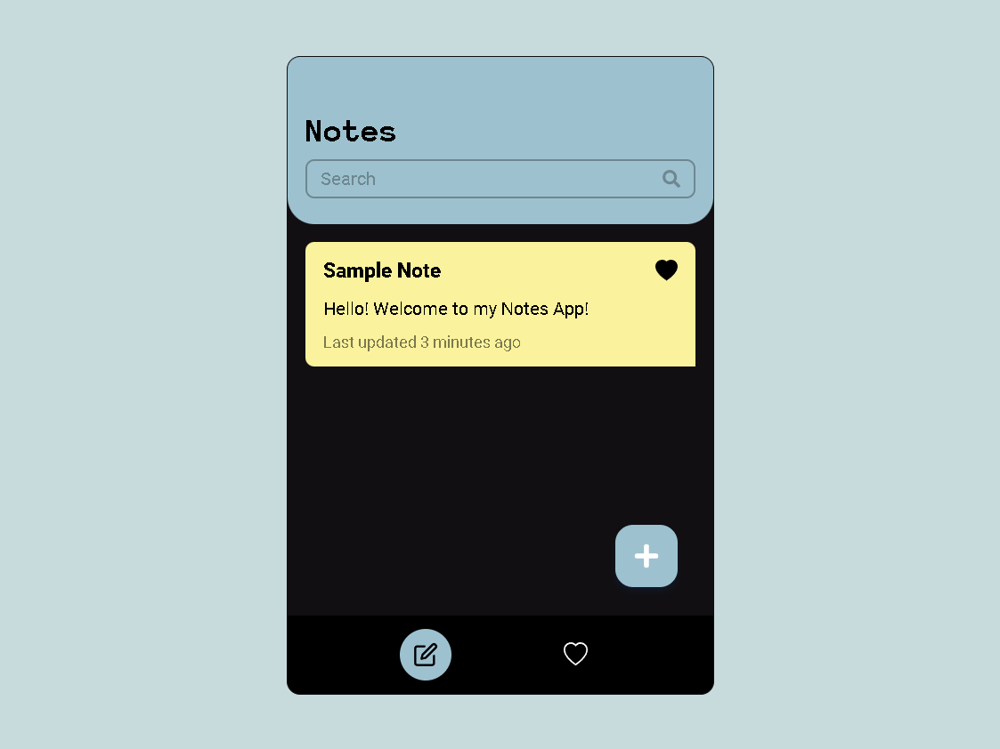
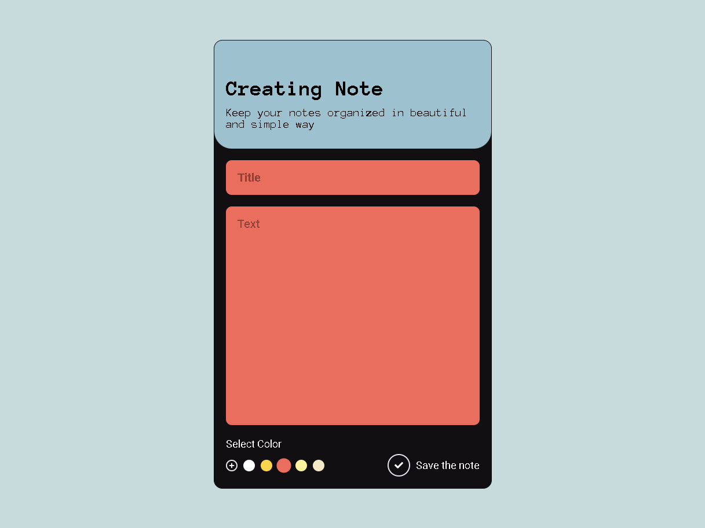

# Notes App using React and Tailwind

A simple notes app built using React, Tailwind, and Vite. I built this to practice my knowledge on React such as components, props, hooks, and event handlers. Overall, a fun experience, learned a lot, and honed my knowledge and experience with React even more!

## Features:

- Basic Create, Read, Update, and Delete functionality
- Add note to favorite
- Filtering notes with search input
- Change the background color of each note

## Overview

List of Notes



Individual Note



Design by Lilia Suschchynska [here](https://www.behance.net/gallery/167126077/Mobile-app-for-creating-notes-and-reminders?tracking_source=search_projects_recommended%7Cnotes+app+design)

## Installation

Clone the repository

> Ensure that you have Node JS installed

```
git clone https://github.com/Lemon1903/notes-app.git

cd notes-app

npm install
```

Start the development server

```
npm run dev
```

Enjoy!

## Live URL:

[https://lemon-notes.netlify.app/](https://lemon-notes.netlify.app/)

> Note: This uses a global database as it doesn't have user authentication. It means that you and the others will share the same data.

If you want to use the local database, clone this repo and go to the following files:

- In `SaveButton.tsx`, change the fetch link to

```typescript
fetch(`http://localhost:3000/notes/${id}`, ...)
```

- In `NoteListItem.tsx`, change the fetch link to

```typescript
fetch(`http://localhost:3000/notes/${note.id}`, ...)
```

- In `useNotes.tsx`, change the fetch link to

```typescript
fetch("http://localhost:3000/notes/");
```

- In `useNote.tsx`, change the fetch link to

```typescript
fetch(`http://localhost:3000/notes/${noteId}`);
```
